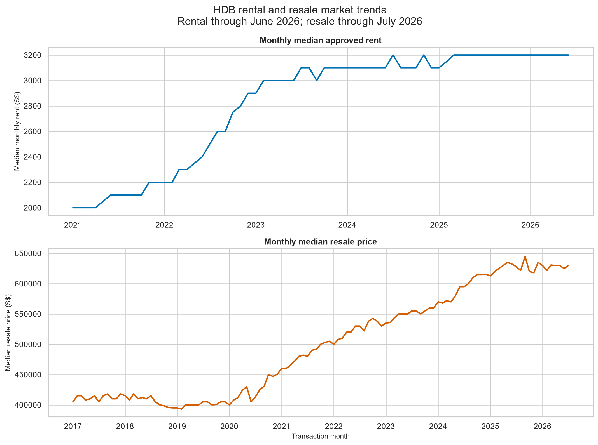
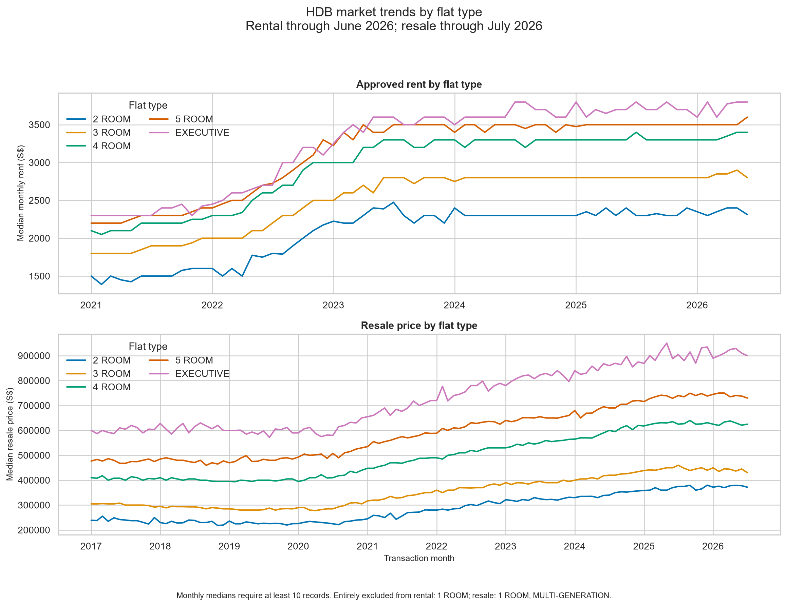
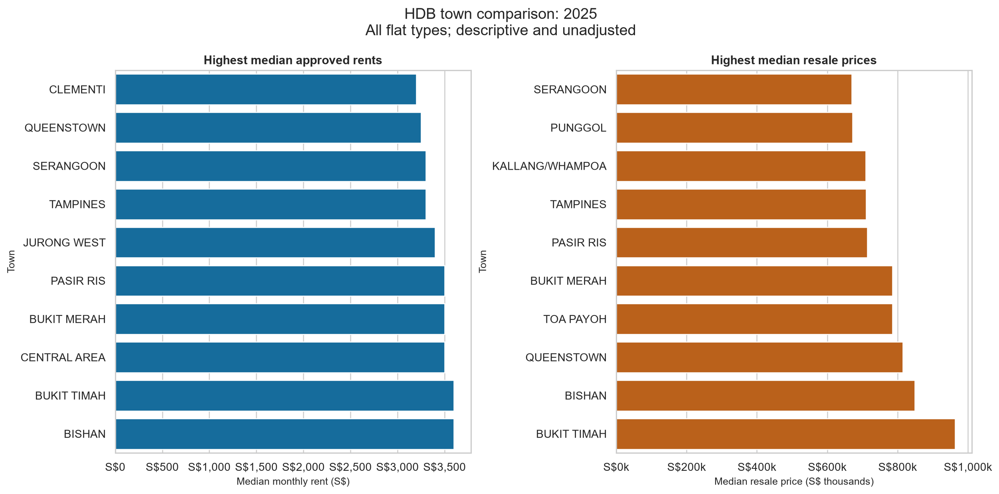
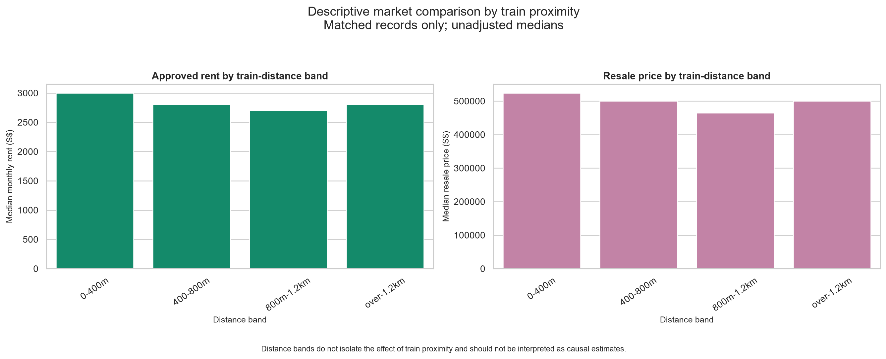
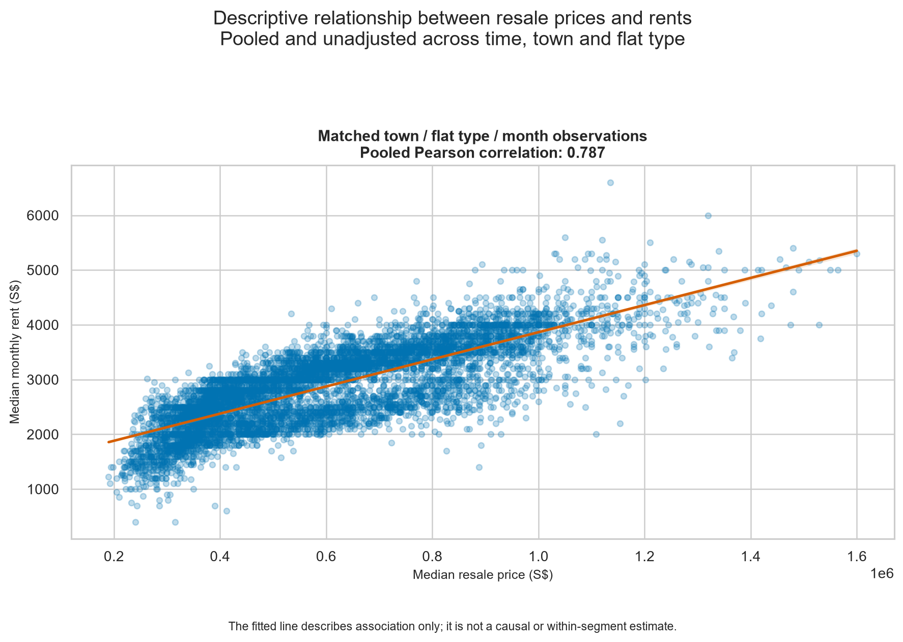
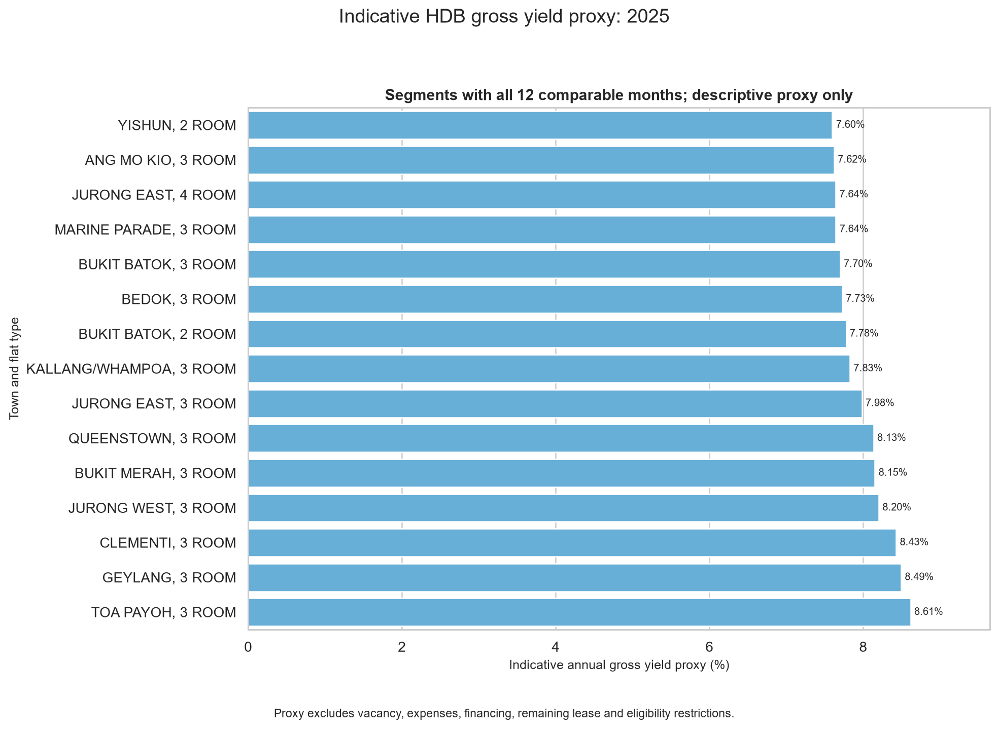
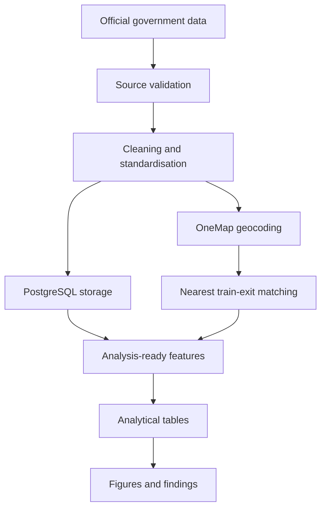

# Singapore HDB Market Analytics

An end-to-end data analytics project examining Singapore HDB rental and resale markets using official government data.

The project combines data acquisition, validation, transformation, PostgreSQL storage, geospatial enrichment and exploratory analysis to study market trends, town-level differences, train accessibility and an indicative gross-rental-yield proxy.

> This is a descriptive portfolio project. Its outputs should not be interpreted as property valuations, investment recommendations or causal estimates.

## Project objectives

The analysis addresses six questions:

1. How have median HDB rents and resale prices changed over time?
2. How do market trends differ across flat types?
3. Which towns recorded the highest median rents and resale prices in 2025?
4. How do market medians vary across distance bands from MRT and LRT exits?
5. What descriptive relationship exists between rents and resale prices?
6. Which town and flat-type segments show higher indicative gross-yield proxies?

## Headline findings

- Overall median approved rent increased from approximately **S$2,000 in early 2021 to S$3,200 by 2025**, before remaining broadly stable through June 2026.
- Overall median resale price increased from approximately **S$405,000 in early 2017 to S$630,000 by July 2026**, with most of the growth occurring after 2020.
- Larger flat types generally recorded higher rents and resale prices, with executive flats remaining the highest-priced category across both markets.
- Matched town, flat-type and monthly observations showed a strong positive pooled association between resale prices and rents (**Pearson correlation: 0.787**). This does not establish causation.
- Properties within **400 metres of a train exit** recorded the highest unadjusted median rents and resale prices, although the comparison does not isolate the effect of accessibility.
- Among segments with all 12 comparable months in 2025, the highest indicative gross-yield proxies were concentrated mainly among **3-room flats**, led by Toa Payoh at approximately **8.61%**.

These findings are descriptive and may reflect differences in time, location, flat characteristics, remaining lease and transaction composition.

## Key outputs

### Overall market trends



The rental and resale series have different starting dates and latest available months. Partial-year 2026 data is explicitly identified to avoid presenting incomplete coverage as a full-year comparison.

### Trends by flat type



Monthly flat-type medians are plotted only when at least 10 records are available. Entirely sparse categories are excluded from the figure but retained in the exported analytical tables.

### Town comparison



The town rankings are unadjusted medians across all included flat types. Differences may therefore reflect each town's transaction mix as well as underlying market conditions.

### Train proximity



Each HDB location is matched to its nearest MRT or LRT exit. These bands describe observed market differences but do not isolate the causal effect of train proximity.

### Rental-resale relationship



This comparison pools matched town, flat-type and monthly observations. The fitted line measures association only and does not control for time, location, remaining lease or other property characteristics.

### Indicative gross-yield proxy



The proxy is calculated as:

```text
median monthly rent x 12
------------------------ x 100
   median resale price
```

The displayed chart requires all 12 comparable months in 2025. The calculation excludes vacancy, expenses, financing, remaining lease, eligibility restrictions and transaction-specific differences.

## Data sources

| Dataset | Provider | Coverage used | Format | Purpose |
|---|---|---:|---|---|
| HDB resale transactions | Housing & Development Board | January 2017 to July 2026 | CSV | Analyse resale prices, transaction volumes and flat characteristics |
| HDB rental transactions | Housing & Development Board | January 2021 to June 2026 | CSV | Analyse approved rents and construct indicative yield proxies |
| MRT and LRT station exits | Land Transport Authority | Current source extract | GeoJSON | Measure proximity to individual station access points |
| Address geocoding | Singapore Land Authority OneMap | Generated during processing | API | Convert HDB block and street addresses into coordinates |

Dataset identifiers and acquisition notes are recorded in [`docs/data_sources.md`](docs/data_sources.md).

Rental amounts are owner-declared approved-rent figures and should be treated as indicative.

## Analytical workflow



### 1. Acquisition

The download pipeline retrieves official HDB rental and resale data and preserves the original source files.

### 2. Validation and cleaning

The pipeline:

- validates required columns and data types;
- checks missing values and invalid dates;
- rejects non-positive prices, rents and floor areas;
- standardises town and flat-type labels;
- converts remaining lease into months;
- separates storey ranges into lower, upper and midpoint values; and
- creates a reproducible `source_row_id` for pipeline traceability.

Exact duplicate rows are retained because the public datasets do not provide transaction IDs or unit numbers. Removing identical observations could therefore delete genuine transactions. The complete policy is documented in [`docs/data_quality.md`](docs/data_quality.md).

### 3. Database layer

PostgreSQL runs through Docker Compose with:

- persistent named storage;
- environment-based credentials;
- a readiness health check; and
- repeatable database initialisation and loading scripts.

### 4. Geospatial enrichment

HDB addresses are geocoded through the OneMap Search API. The project then calculates the nearest MRT or LRT exit for each usable HDB location.

Individual exits are preserved because walking access to an entrance is more informative than distance to a station centroid.

### 5. Analysis and reporting

Reusable functions aggregate the cleaned data into monthly, flat-type, town, train-distance and cross-market outputs. Ten tables are exported as CSV files and six visualisations are saved as PNG files.

## Data-quality decisions

Notable decisions include:

- **Resale duplicates:** 316 additional exact rows across 315 duplicate groups were retained.
- **Rental duplicates:** 1,516 additional exact rows across 1,462 duplicate groups were retained.
- **Town standardisation:** rental label `CENTRAL` was mapped to `CENTRAL AREA`.
- **Sparse monthly series:** flat-type trend points require at least 10 records.
- **Train exits:** 613 exit records across 190 station names were retained as separate access points.
- **Source preservation:** transformations do not overwrite the original source files.
- **Pipeline identifiers:** `source_row_id` is not treated as an official transaction identifier.

## Repository structure

```text
singapore-hdb-market-analytics/
|-- data/
|   |-- raw/                         # Original downloaded data
|   |-- interim/                     # Intermediate processing outputs
|   `-- processed/                   # Cleaned and enriched datasets
|-- docs/
|   |-- data_quality.md
|   `-- data_sources.md
|-- reports/
|   |-- figures/                     # Six presentation-ready charts
|   `-- tables/                      # Ten analytical CSV outputs
|-- sql/
|   `-- analysis/
|       |-- 01_fully_adjusted_yield_exceptions.sql
|       |-- 02_annual_market_yields.sql
|       |-- 03_2025_yield_compression_summary.sql
|       `-- 04_2025_yield_change_details.sql
|-- src/
|   |-- download_data.py
|   |-- clean_data.py
|   |-- init_db.py
|   |-- load_data.py
|   |-- prepare_geocoding_addresses.py
|   |-- geocode_hdb_addresses.py
|   |-- prepare_train_station_coordinates.py
|   |-- prepare_train_station_proximity.py
|   |-- join_train_station_proximity.py
|   |-- prepare_analysis_features.py
|   |-- explore_data.py
|   `-- test_connection.py
|-- .env.example
|-- docker-compose.yml
`-- requirements.txt
```

## Reproducing the project

### Prerequisites

- Python 3
- Docker Desktop or another Docker Compose-compatible runtime
- OneMap API credentials
- Git

### 1. Clone the repository

```bash
git clone https://github.com/triablefungi/singapore-hdb-market-analytics.git
cd singapore-hdb-market-analytics
```

### 2. Create a virtual environment

```bash
python -m venv .venv
```

Activate it on Windows:

```powershell
.\.venv\Scripts\Activate.ps1
```

Activate it on macOS or Linux:

```bash
source .venv/bin/activate
```

### 3. Install dependencies

```bash
python -m pip install --upgrade pip
pip install -r requirements.txt
```

The single `requirements.txt` file contains the project's runtime dependencies and test tooling, including `pytest`.

### 4. Configure environment variables

Copy `.env.example` to `.env` and replace the placeholder values:

```text
POSTGRES_DB=hdb_market
POSTGRES_USER=hdb_user
POSTGRES_PASSWORD=<local-password>
POSTGRES_HOST=127.0.0.1
POSTGRES_PORT=5433

ONEMAP_EMAIL=<onemap-email>
ONEMAP_PASSWORD=<onemap-password>
```

Do not commit `.env`, credentials or OneMap access tokens.

### 5. Start PostgreSQL

```bash
docker compose up -d
```

### 6. Run the pipeline

```bash
python src/init_db.py
python src/download_data.py
python src/clean_data.py
python src/load_data.py
python src/prepare_geocoding_addresses.py
python src/geocode_hdb_addresses.py
python src/prepare_train_station_coordinates.py
python src/prepare_train_station_proximity.py
python src/join_train_station_proximity.py
python src/prepare_analysis_features.py
python src/explore_data.py
```

Geocoding requires valid OneMap credentials and may take longer than the local transformation steps.

### 7. Inspect the outputs

Generated analytical tables are stored in `reports/tables/`.

Generated figures are stored in `reports/figures/`.

## Main analytical tables

| Output | Description |
|---|---|
| `rental_monthly_trend.csv` | Overall monthly median approved rent |
| `resale_monthly_trend.csv` | Overall monthly median resale price |
| `rental_flat_type_monthly.csv` | Monthly rent by normalised flat type |
| `resale_flat_type_monthly.csv` | Monthly resale price by normalised flat type |
| `rental_town_summary_2025.csv` | Town-level rental summary for 2025 |
| `resale_town_summary_2025.csv` | Town-level resale summary for 2025 |
| `rental_train_distance_summary.csv` | Rent summary by train-distance band |
| `resale_train_distance_summary.csv` | Resale summary by train-distance band |
| `cross_market_monthly_panel.csv` | Matched town, flat-type and monthly rental-resale panel |
| `indicative_gross_yield_2025.csv` | Indicative 2025 gross-yield segments |

## SQL analyses

Four PostgreSQL queries in `sql/analysis/` extend the main Python analysis with focused investigation of annual gross-rental-yield changes. They are intended to be run after the cleaned rental and resale data have been loaded into PostgreSQL.

| Query | Purpose |
|---|---|
| [`01_fully_adjusted_yield_exceptions.sql`](sql/analysis/01_fully_adjusted_yield_exceptions.sql) | Tests the two apparent 2024-2025 yield-increase exceptions - Geylang 5-room and Bukit Batok executive flats - after holding the 2024 lease-band resale mix and street-level rental mix constant. |
| [`02_annual_market_yields.sql`](sql/analysis/02_annual_market_yields.sql) | Calculates unadjusted annual median resale prices, median monthly rents, gross-rental-yield proxies and year-over-year changes by town and flat type. |
| [`03_2025_yield_compression_summary.sql`](sql/analysis/03_2025_yield_compression_summary.sql) | Summarises the share of eligible town and flat-type combinations with declining, unchanged or rising yield proxies from 2024 to 2025. Each combination requires at least 50 resale and 50 rental records in both years. |
| [`04_2025_yield_change_details.sql`](sql/analysis/04_2025_yield_change_details.sql) | Provides the detailed record counts, medians, price and rent growth, yields, yield changes and classifications behind the 2025 compression summary using the same sample-size threshold. |

These queries remain descriptive. The unadjusted analyses can still reflect changes in remaining lease, street composition and transaction mix. The first query tests composition sensitivity only for the two apparent exceptions.

## Limitations

- Rental figures are owner-declared and indicative.
- Exact records cannot be uniquely identified without official transaction or unit identifiers.
- Medians are descriptive and do not adjust for floor level, remaining lease, floor area or transaction mix.
- Train-distance comparisons do not account for neighbourhood amenities, accessibility routes or other confounders.
- The rental-resale relationship pools observations across locations and time.
- The yield proxy does not represent realised investment returns.
- The latest 2026 periods are incomplete and should not be compared with complete calendar years without qualification.
- OneMap geocoding quality depends on source-address consistency and API results.

## Skills demonstrated

- Python and pandas data engineering
- Exploratory data analysis
- SQL and PostgreSQL
- Docker Compose
- REST API integration
- Data validation and quality documentation
- Geospatial distance analysis
- Reproducible analytical pipelines
- Matplotlib and seaborn visualisation
- Git and GitHub version control
- Responsible interpretation of public data

## Responsible use

This repository is intended for learning and portfolio demonstration. It is not affiliated with HDB, LTA, SLA or data.gov.sg, and its outputs should not be used as professional financial, property or investment advice.
